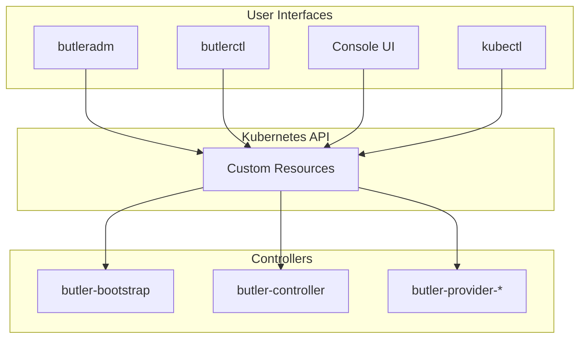
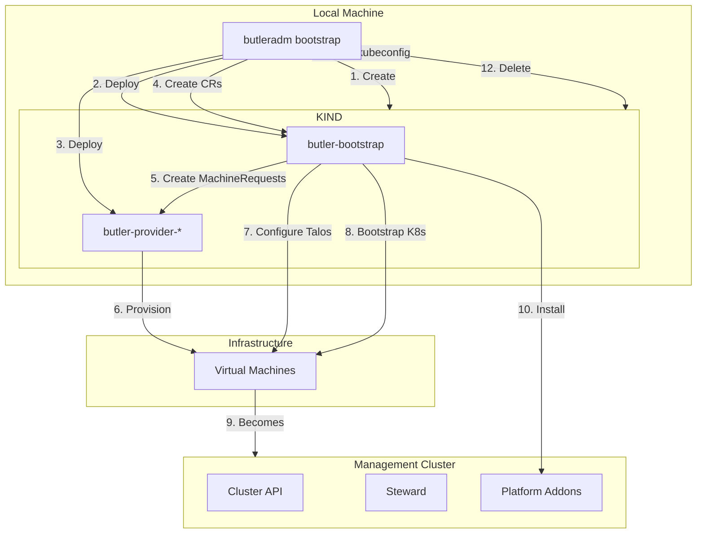
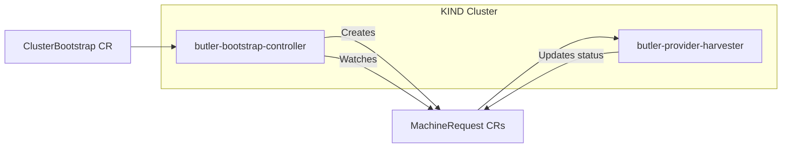
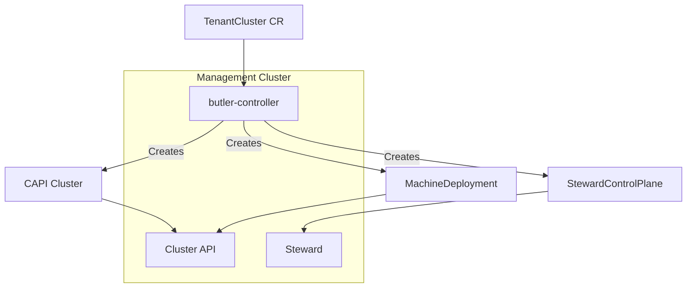
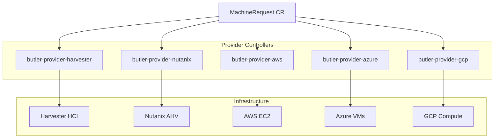

# Butler CLI Design

This document describes the architecture and design decisions behind the Butler CLI tools.

## Table of Contents

- [Design Philosophy](#design-philosophy)
- [Two CLIs for Two Audiences](#two-clis-for-two-audiences)
- [CRDs as the API](#crds-as-the-api)
- [Bootstrap Flow](#bootstrap-flow)
- [Controller Interaction](#controller-interaction)
- [Multi-Provider Architecture](#multi-provider-architecture)
- [Future Considerations](#future-considerations)

## Design Philosophy

Butler CLI follows these principles:

1. **Kubernetes-native**: Use CRDs and controllers, not imperative scripts
2. **Declarative**: Describe desired state, let controllers reconcile
3. **Resumable**: Operations can be interrupted and resumed
4. **Auditable**: All state visible in Kubernetes API
5. **Consistent**: Same resources whether created by CLI, Console, or kubectl
6. **Provider-agnostic**: Core logic works across any infrastructure

## Two CLIs for Two Audiences

Butler provides two distinct CLI tools rather than a single monolithic binary.

### butleradm

Target audience: Platform Operators (infrastructure teams, SREs)

Responsibilities:
- Bootstrap management clusters
- Upgrade Butler platform components
- Backup and restore operations
- Platform health monitoring

Typical usage frequency: Occasional (initial setup, maintenance windows)

Permission requirements: Cluster admin on management cluster, infrastructure credentials

### butlerctl

Target audience: Platform Users (developers, application teams)

Responsibilities:
- Create and manage tenant clusters
- Enable and configure addons
- Manage access and permissions
- Retrieve kubeconfigs

Typical usage frequency: Daily

Permission requirements: Namespace-scoped RBAC on management cluster

### Why Not One CLI?

Several alternatives were considered:

**Single CLI with subcommands** (`butler adm bootstrap`, `butler ctl cluster create`)

Rejected because:
- Larger binary for users who only need one set of commands
- Confusing permission model
- More complex RBAC configuration

**kubectl plugins** (`kubectl butler-adm`, `kubectl butler-ctl`)

Rejected because:
- Requires kubectl installation and configuration
- Plugin discovery and versioning complexity
- Bootstrap needs to run before any cluster exists

**The chosen approach** mirrors the Kubernetes ecosystem pattern of `kubeadm` (admin) and `kubectl` (user), which is familiar to operators and provides clear separation of concerns.

## CRDs as the API

All Butler operations are expressed as Kubernetes Custom Resources. The CLIs are thin clients that:

1. Parse user input and configuration files
2. Construct CR objects
3. Apply CRs to the Kubernetes API
4. Watch CR status for completion



### Core CRDs

| CRD | Purpose |
|-----|---------|
| ClusterBootstrap | Management cluster lifecycle |
| MachineRequest | VM provisioning requests (provider-agnostic) |
| ProviderConfig | Infrastructure provider credentials and settings |
| TenantCluster | Tenant cluster lifecycle |
| PlatformAddon | Addon installation requests |
| ClusterAccess | RBAC and access grants |

### Benefits

**Consistency**: A TenantCluster created via `butlerctl cluster create` is identical to one created via the Console or `kubectl apply`.

**Resumability**: If a bootstrap is interrupted, rerunning the command picks up where it left off because controllers reconcile toward the desired state stored in the CR.

**Auditability**: All operations are visible in the Kubernetes API. Standard audit logging captures who created what and when.

**Extensibility**: New features can be added by defining new CRDs and controllers without modifying the CLI.

## Bootstrap Flow

The bootstrap process has unique requirements because no Kubernetes cluster exists yet. Butler solves this with a temporary local cluster.



### Phase Details

| Phase | Description |
|-------|-------------|
| Local Setup | Create KIND, deploy controllers, create CRs |
| ProvisioningMachines | Provider controller creates VMs |
| ConfiguringTalos | Generate and apply Talos machine configs |
| BootstrappingCluster | Run talosctl bootstrap, retrieve kubeconfig |
| InstallingAddons | Install platform components in dependency order |
| Completion | Save outputs, delete KIND |

### Why KIND?

The temporary KIND cluster provides:

- Standard Kubernetes API for controller deployment
- Watch-based status updates (no polling scripts)
- Familiar debugging with kubectl
- Clean separation between orchestration and infrastructure
- Ability to pause/resume by preserving KIND cluster

Alternatives considered:

- **Shell scripts**: Fragile, no idempotency, hard to test
- **Standalone binary with embedded logic**: No resumability, monolithic
- **Existing cluster requirement**: Chicken-and-egg problem

## Controller Interaction

### During Bootstrap



### After Bootstrap (Management Cluster)



## Multi-Provider Architecture

Butler is designed to support multiple infrastructure providers across on-premises and public cloud environments.

### Supported Platforms

**On-Premises:**
- Harvester HCI (Supported)
- Nutanix AHV (Planned)
- Proxmox VE (Planned)

**Public Cloud:**
- AWS (Planned)
- Azure (Planned)
- Google Cloud (Planned)

### Provider Abstraction



Each provider controller:
- Lives in its own repository
- Watches MachineRequest CRs
- Only processes requests matching its provider type
- Uses provider-specific APIs and SDKs
- Reports status back to the MachineRequest

The MachineRequest CRD is provider-agnostic. Adding a new provider requires only a new controller, not changes to the CLI or bootstrap logic.

## Future Considerations

### Console Integration

The Butler Console will be a web application that:
1. Authenticates users against the management cluster
2. Creates the same CRDs as the CLI
3. Provides real-time status via watch streams
4. Offers visualization and dashboards

No changes to controllers are required because the CRDs are the API.

### GitOps Integration

Because all state is expressed as CRDs, Butler integrates naturally with GitOps workflows:

```yaml
# In a Git repository managed by Flux/ArgoCD
apiVersion: butler.butlerlabs.dev/v1alpha1
kind: TenantCluster
metadata:
  name: production
  namespace: butler-system
spec:
  controlPlane:
    type: hosted
    version: "1.31.0"
  machinePools:
    - name: default
      replicas: 5
```

Changes to cluster configuration go through pull requests, providing review and audit trails.

### Multi-Cloud Tenant Clusters

With provider controllers for public clouds, Butler can provision tenant clusters across different environments from a single management cluster:

- Management cluster on-premises (Harvester)
- Production tenant clusters on AWS
- Development tenant clusters on-premises
- Disaster recovery on Azure

The architecture supports this without modification because provider selection is per-cluster via the ProviderConfig reference.
